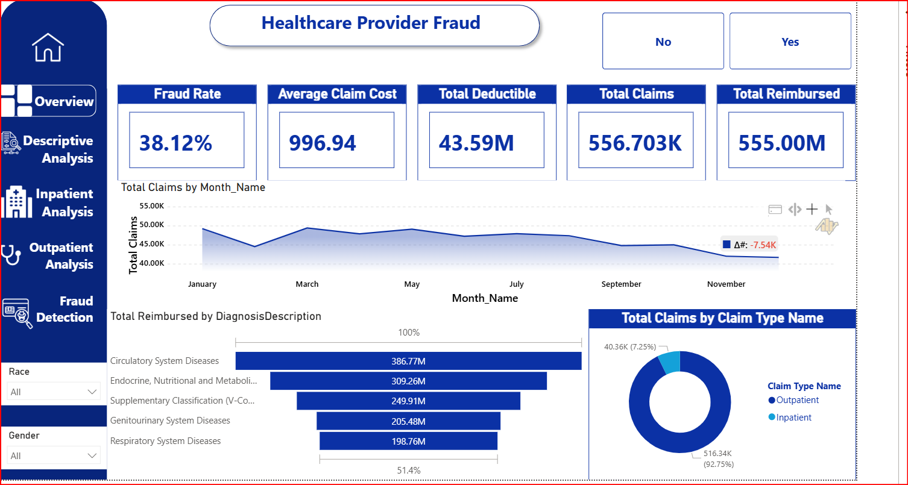
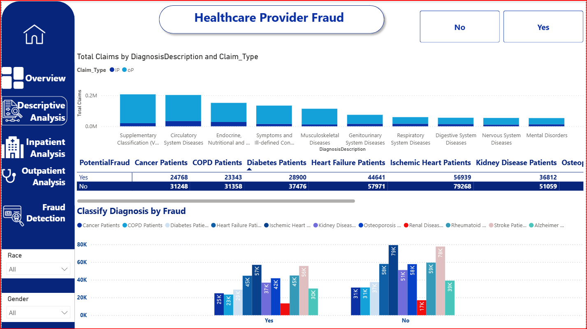
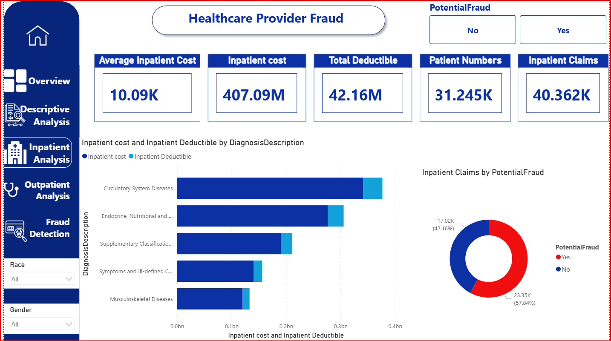
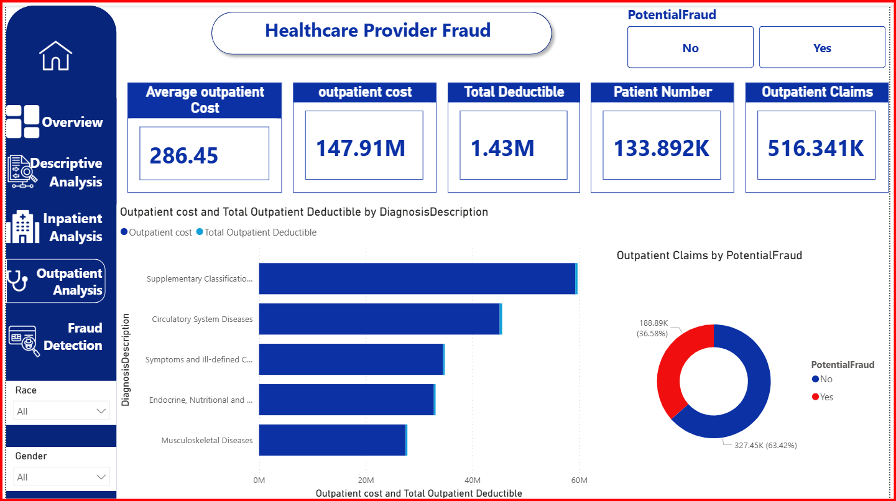
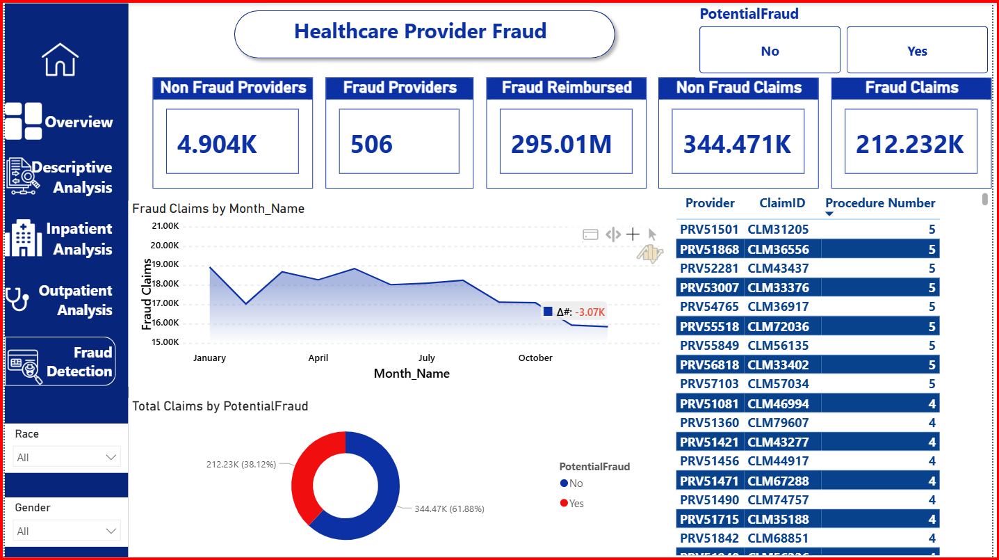

# 🏥 End-to-End Healthcare Fraud Detection Platform

A multi-phase data engineering platform that spans on-premises ingestion, cloud warehousing, dimensional modeling, machine learning, and real-time prediction — all unified around one objective: **detecting fraudulent healthcare insurance claims** in a Medicare-style claims dataset.

**Stack:** FastAPI · Apache Kafka · Snowflake · dbt · Databricks · Power BI · SSIS · SSAS · Flask · n8n · Telegram

**Team:** Amal Abdelmotamed · Shahd Safwat Mohamed · Merna Medhat · Hadeer Badr · Sondos Abdelmoez

---

## 📌 Executive Summary

The platform is architected in **three complementary layers**:

1. **Cloud Data Engineering Pipeline** — FastAPI ingests raw patient/claims data → streams it via **Kafka** → lands in **Snowflake** → transformed by **dbt** into a governed Kimball-style star schema. A parallel **Databricks Medallion (Bronze/Silver/Gold)** pipeline supports heavier data quality validation and advanced analytics.
2. **On-Premises Data Warehouse** — A SQL Server DWH built with **SSIS**, applying the same star schema design with unpivot transformations, lookup-based surrogate key resolution, and a role-playing date dimension.
3. **Real-Time Fraud Screening System** — A Gradient Boosting classifier (90.59% accuracy) served via **Flask REST API**, made accessible to medical staff through a **Telegram chatbot** automated by **n8n**.

Core engineering principles: **separation of concerns**, **incremental processing**, and **auditability**.

---

## 📌 Project Overview

Four healthcare claims datasets are ingested, mirroring a real-world Medicare fraud dataset:

| Dataset | Description |
|---|---|
| Patient Data | Demographics, chronic condition indicators, Part A/B coverage, annual reimbursement |
| Inpatient Claims | Admission claims with admission/discharge dates, diagnosis/procedure codes, physicians |
| Outpatient Claims | Non-admission claims (same structure, no admission/discharge dates) |
| Fraud Provider Data | Binary fraud label per provider |

**Goal:** combine these sources into one analytical model to help fraud analysts spot patterns — abnormal claim volumes, irregular diagnosis/procedure combinations, or claims clustered around specific physicians.

---

## 🏗️ Architecture Overview
FastAPI (On-Prem)
│
▼
Kafka Producers / Topics (On-Prem)
│
▼
Kafka Consumers ──▶ write_pandas
│
▼
Snowflake (Cloud) ── Raw / Staging Tables
│
▼
dbt ── Staging Models → Dimension Models → Fact Table → Bridge Tables
│
▼
Snowflake ── Star Schema (DWH Layer)
│
▼
Databricks ── Bronze → Silver → Gold (Medallion Architecture)
│
▼
Power BI ── Dashboards & Fraud KPIs

In parallel, an **on-premises SSIS/SSAS pipeline** builds the same star schema directly in SQL Server, and a **Flask + n8n + Telegram** layer provides real-time, single-claim fraud scoring.

---

## ⚙️ Phase 1 — Data Ingestion (FastAPI)

A FastAPI service exposes HTTP endpoints (`POST /send-new-data`) that read raw CSV files and publish their contents as JSON messages to Kafka topics.

---

## ⚙️ Phase 2 — Kafka Streaming

Kafka decouples ingestion from storage: the FastAPI service doesn't know about Snowflake, and the Snowflake-loading consumer doesn't know how the data was generated — they only share a message schema contract.

**Topics (one per source):**

| Topic | Purpose |
|---|---|
| `patient_topic` | Beneficiary demographics & chronic conditions |
| `inpatient_topic` | Inpatient claims |
| `outpatient_topic` | Outpatient claims |
| `provider_topic` | Provider-level fraud labels |

**Consumer groups** (e.g. `snowflake_consumer_v1`) track offsets per topic/partition for crash recovery, and allow horizontal scaling by adding more consumers without code changes.

---

## ☁️ Phase 3 — Snowflake Cloud Warehouse

| Object | Configuration |
|---|---|
| Warehouse | Single `XSMALL`, `AUTO_SUSPEND=60s`, `AUTO_RESUME=TRUE` |
| Schema `raw/public` | Raw landing tables written directly by the Kafka consumer |
| Schema `dwh` (via dbt) | Dimensional model — all `DIM_` tables, `FACT_TABLE`, bridge tables |

Incremental loading happens at two levels: Kafka-consumer batching (`write_pandas`, e.g. every 10,000 records) and dbt's `incremental` materialization using a watermark column.

---

## 🔄 Phase 4 — dbt Transformations

### Staging Models
Light cleaning only, no business logic or joins:

| Model | Role |
|---|---|
| `patient_stg` | Cleans beneficiary demographics & chronic conditions |
| `dim_Physician_stg` | Unions Attending/Operating/Other physician columns |
| `dim_location_stg` | Distinct State/County combinations |
| `dim_fraud_stg` | Distinct Provider / PotentialFraud pairs |
| `dim_ClmDiagnosisCode_stg` | Unpivots 10 diagnosis columns into long format |
| `dim_ClmProcedureCode_stg` | Unpivots 6 procedure columns into long format |
| `dim_DiagnosisGroup_code_stg` | Distinct DRG codes (inpatient only) |
| `dim_date_stg` | Full calendar date spine |

### Dimension Models (Star Schema)

- `dim_Physician_dwh` — role-playing, joined 3× (Attending/Operating/Other)
- `dim_location_dwh`, `dim_fraud_dwh`
- `dim_gender_race_dwh` — junk dimension (Gender + Race)
- `dim_ClmDiagnosisCode_dwh`, `dim_ClmProcedureCode_dwh` — bridge table targets
- `dim_DiagnosisGroup_code_dwh`
- `dim_date_dwh` — role-playing, joined 6× (start, end, admission, discharge, birth, death)

All dimensions use `ROW_NUMBER()`-generated surrogate keys, decoupling the model from source-system natural keys.

### Fact Table (`fact_table`)

- **Grain:** one row per `ClaimID`, differentiated by `ClaimType` ('IP'/'OP')
- **Measures:** `InscClaimAmtReimbursed`, `DeductibleAmtPaid`, derived `LengthOfStay` (inpatient only)
- **Foreign keys:** all dimensions, with physician & date as role-playing dimensions joined multiple times
- NULL admission/discharge dates for outpatient claims are handled via `LEFT JOIN` so records aren't dropped

### Bridge Tables

`bridge_claim_diagnosis` and `bridge_claim_procedure` resolve the many-to-many relationship between claims and diagnosis/procedure codes — one row per claim-code pairing, with a sequence number. Power BI relationships use a many-to-many relationship type to slice at diagnosis/procedure level without double-counting claim measures.

---

## 🧱 Phase 5 — Databricks Medallion Architecture (ELT)

Runs in parallel to the Snowflake/dbt path for heavier data engineering and ML feature workloads:

- **Bronze** — raw, unmodified landing zone (Delta Lake), fully auditable/replayable
- **Silver** — cleaned, standardized, validated; holds all dim/fact tables and raw data
- **Gold** — curated, analytics-ready; all transformations applied here

Orchestrated via Databricks Workflows (`bronze_layer → silver_layer → gold_layer`).

---

## 🔁 Phase 6 — Incremental Loading

| Strategy | Where Used | Notes |
|---|---|---|
| Append | Kafka → Snowflake raw tables | Claims are immutable once submitted |
| Deduplication | dbt staging layer | `QUALIFY ROW_NUMBER() OVER (PARTITION BY ClaimID ORDER BY load_timestamp DESC) = 1` guards against Kafka's at-least-once delivery |
| Merge/Upsert | Fraud provider data | dbt's `merge` incremental strategy on a `unique_key` (e.g. `Provider`) |

---

## 🕹️ Phase 7 — Orchestration

Databricks Workflows schedules two dependent tasks:

- `incremental_load` — writes new data into Bronze/Silver with cleaning & deduplication
- `gold_layer` — runs only after `incremental_load` succeeds, rebuilding curated Gold tables

This dependency-based execution guarantees consistency between layers even if a task runs long.

---

## 🧩 On-Premises DWH (SSIS / SSAS)

### Star Schema (SQL Server)

**Dimensions:** `DIM_DIAGNOSIS`, `DIM_PROCEDURE`, `DIM_GEN_RAC`, `DIM_LOCATION`, `DIM_FRAUD`, `DIM_PHYSICIAN`, `DIM_PATIENT` (with chronic-condition flags), `DIM_DATE` (role-playing, ×6)

**Bridge tables:** `BRIDGE_CLAIM_DIAGNOSIS`, `BRIDGE_CLAIM_PROCEDURE`

**Fact table:** `FACT_CLAIMS` — surrogate keys + measures, with `Claim_Type` as a degenerate dimension

### ETL / SSIS Architecture

- **Cleanup:** `TRUNCATE` all tables in dependency order before each run
- **Bridge flow:** `OLE DB Source → Unpivot → Conditional Split → Lookup → OLE DB Destination`
- **Fact flow:** OBT from STG → 11 sequential Lookups (5 standard dims + 6 role-playing date lookups with *Ignore Failure* for nullable dates) → `FACT_CLAIMS`
- **Control flow:** Sequence Container groups all dimension Data Flows in parallel; a green precedence constraint blocks the Fact package until all dimensions/bridges succeed, preventing FK violations

| Engineering Tactic | Purpose |
|---|---|
| Many-to-Many Resolution | Bridge tables linked by `ClaimID` |
| Role-Playing Dimension | One `DIM_DATE` serving 6 roles |
| Degenerate Dimension | `Claim_Type` kept in the fact table |
| Data Cleaning & Trimming | Prevents `DTS_E_PROCESSINPUTFAILED` |

### SSAS Tabular Model & DAX

Built on `FACT_CLAIMS`; all business logic lives in DAX measures (not calculated columns):

```DAX
Total Claims := COUNT([ClaimID])
Total Reimbursed := SUM([InscClaimAmtReimbursed])
Total Deductible := SUM([DeductibleAmtPaid])
Fraud Rate := DIVIDE([Fraud Claims], [Total Claims])
Average Inpatient Cost := DIVIDE([Inpatient cost], [Inpatient Claims])
```

Plus chronic-condition measures (Cancer, Diabetes, COPD, Heart Failure, Ischemic Heart, Kidney Disease, Osteoporosis, Rheumatoid Arthritis, Stroke, Renal Disease) via `DISTINCTCOUNT([BeneID])` filtered on each `DIM_PATIENT` flag.

---

## 📊 Power BI Dashboard


### Overview

Fraud Rate 38.12% · Avg Claim Cost 996.94 · Total Deductible 43.59M · Total Claims 556.703K · Total Reimbursed 555.00M

### Descriptive Analysis

Claims by diagnosis & claim type, chronic-condition fraud breakdown matrix, diagnosis classification by fraud.

### Inpatient Analysis

Avg Inpatient Cost 10.09K · Inpatient Cost 407.09M · Patients 31.245K · Claims 40.362K

### Outpatient Analysis

Avg Outpatient Cost 286.45 · Outpatient Cost 147.91M · Patients 133.892K · Claims 516.341K

### Fraud Detection

Fraud Providers 506 vs Non-Fraud 4.904K · Fraud Reimbursed 295.01M · Fraud Claims 212.232K vs Non-Fraud 344.471K, with a monthly fraud trend and a detailed Provider/ClaimID/Procedure table.

---

## 🤖 Real-Time Fraud Screening System

### What It Does
An end-to-end intelligent system that collects patient/claim data interactively through a **Telegram chatbot**, feeds it to a trained ML model via a **REST API**, and returns a fraud prediction — fully automated through an **n8n workflow**.

### Problem It Solves
Manual review of every claim is slow and expensive. This system automates initial fraud screening: collects structured data via Telegram → runs it through a Gradient Boosting classifier → returns an instant probability score → lets reviewers focus on flagged high-risk cases.

### System Components

| Component | Technology | Role |
|---|---|---|
| ML Model | Gradient Boosting (scikit-learn) | Predicts fraud probability |
| REST API | Flask + ngrok | Serves predictions over HTTP |
| Automation | n8n Workflow | Orchestrates data collection & routing |
| Interface | Telegram Bot | User-facing chatbot |
| Storage | n8n Data Table | Persists session state across messages |

### Dataset & Features

Source: Kaggle *Healthcare Provider Fraud Detection Analysis* (`rohitrox/healthcare-provider-fraud-detection-analysis`), merged into 650,000+ records across Train / Beneficiary / Inpatient / Outpatient files.

**Class imbalance (SMOTE-balanced):**

| Dataset | Not Fraud | Fraud | Total |
|---|---|---|---|
| Before SMOTE | 241,790 | 148,957 | 390,747 |
| After SMOTE | 241,790 | 241,790 | 483,580 |
| Test Set | 103,625 | 63,839 | 167,464 |

**12 features exposed via the Telegram bot** (selected by Mutual Information scoring): chronic conditions (diabetes, ischemic heart, heart failure), Part A/B coverage months, gender, state, race, deductible/reimbursement amounts (claim-level and annual inpatient).

### ML Model

- **Algorithm:** Gradient Boosting Classifier (scikit-learn)
- **Hyperparameters:** `learning_rate=0.2`, `max_depth=7`, `n_estimators=50`, `random_state=42`
- **Training:** Google Colab (T4 GPU) — merge → preprocess → feature engineer (`phy_count`, `period`) → Mutual Information feature selection (top 24) → 70/30 stratified split → `MinMaxScaler` → SMOTE → train → export (`fraud_model.keras`, `scaler.pkl`, `features.pkl`)

**Performance (167,464-row test set):**

| Metric | Not Fraud | Fraud | Overall |
|---|---|---|---|
| Precision | 92% | 88% | — |
| Recall | 93% | 87% | — |
| F1-Score | 92% | 88% | — |
| Accuracy | — | — | **90.59%** |
| Train Accuracy | — | — | 91.60% |

**Confusion Matrix:**

| | Predicted: Not Fraud | Predicted: Fraud |
|---|---|---|
| **Actual: Not Fraud** | 96,123 (TN) | 7,502 (FP) |
| **Actual: Fraud** | 8,261 (FN) | 55,578 (TP) |

### API (Flask + ngrok)

`POST /predict` — accepts the 12 feature values as JSON, reindexes to match `features.pkl`, scales with `MinMaxScaler`, runs `model.predict()`, applies a 0.5 threshold, and returns:

```json
{
  "prediction": 0,
  "probability": 0.0312,
  "result": "Not Fraud"
}
```

`GET /` — health check.

Runs inside Google Colab, exposed publicly via ngrok (URL changes per session unless on a paid static-domain plan).

### n8n Workflow

Two branches diverging from one decision node:

| Branch | Trigger | Flow |
|---|---|---|
| Continue | `action = 'upsert'` (survey in progress) | Save Session → Send Next Question |
| Done | `action = 'done'` (12 answers collected) | Build Payload → Call API → Send Result → Delete Session |

An error-handling sub-workflow notifies the user via Telegram if any node fails. Session state (`chat_id`, step, 12 answers) is stored in an n8n Data Table (`medical_sessions`), enabling multi-user support and resumable conversations.

### Telegram Bot

Acts as a conversational form — asks 12 questions one at a time, then returns a formatted fraud probability result (🔴 Potential Fraud Detected / 🟢 No Fraud Indicators Detected). Full round trip: ~2–4 seconds.

### Results & Insights

- Small train/test accuracy gap (91.60% vs 90.59%) → good generalization, no major overfitting
- SMOTE balancing raised Fraud-class recall to 87%
- Most informative feature overall: Provider ID (MI: 0.664); most informative *clinical* features: Ischemic Heart & Diabetes (MI: 0.064 each)

### Future Work

- Expand the bot to all 24 training features; try XGBoost/LightGBM; add SHAP explainability
- Deploy the API to a persistent cloud host (AWS/GCP/Heroku) with auth, input validation, and rate limiting
- Add inline keyboard buttons, input validation, multi-language support, and an admin logging dashboard
- Host n8n on a VPS with PostgreSQL-backed session storage

---

## 📄 Documentation

Full technical documentation (architecture diagrams, SSIS/DWH screenshots, dbt lineage, ML pipeline, n8n workflow) is available in `Healthcare Fraud Detection Platform (1).pdf`.

---

## 👩‍💻 Team

**Amal Abdelmotamed · Shahd Safwat Mohamed · Merna Medhat · Hadeer Badr · Sondos Abdelmoez**

- GitHub (Shahd): [Shahdsafwat](https://github.com/Shahdsafwat)
- LinkedIn (Shahd): [shahd-safwat-mohamed](https://linkedin.com/in/shahd-safwat-mohamed-965213262)
